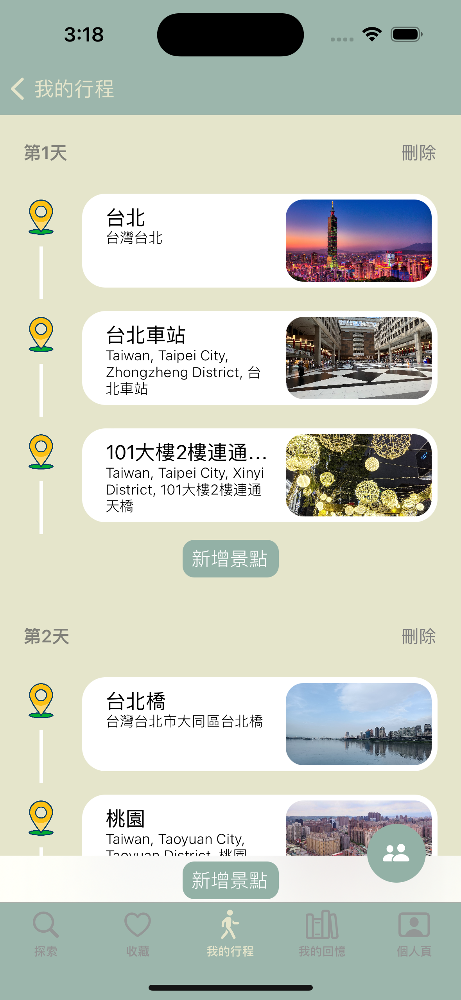
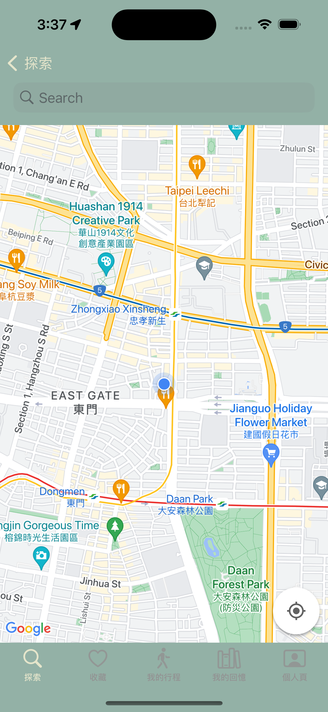
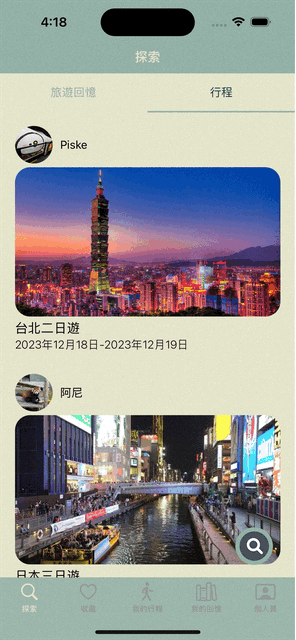
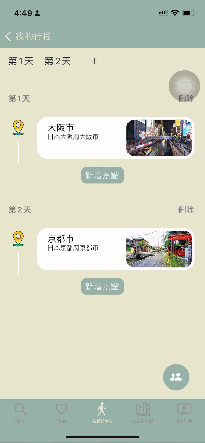
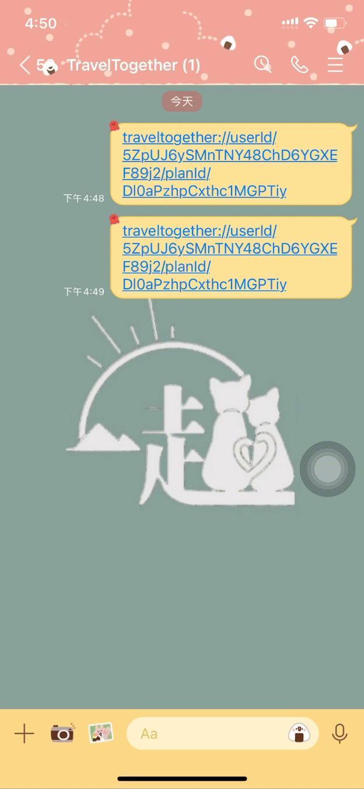
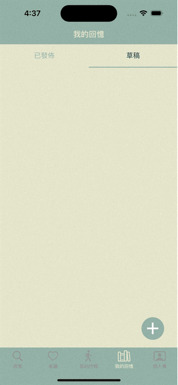
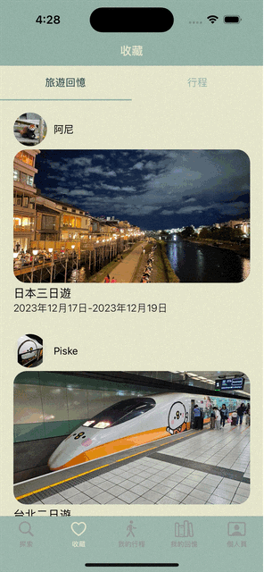
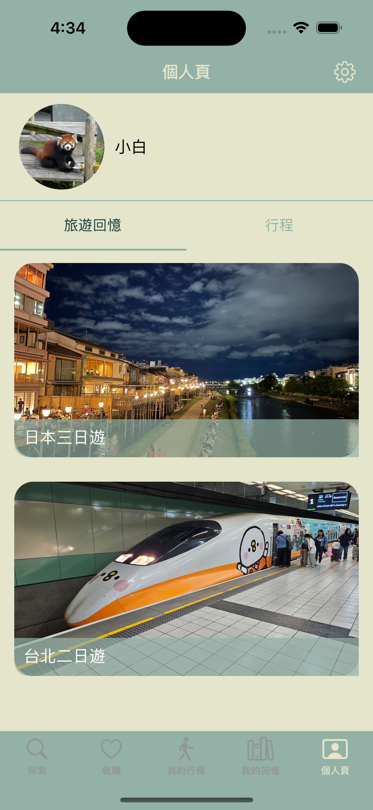

# TravelTogether
## Introduction   
TravelTogether is a platform designed for travel enthusiasts and aims to provide users with a convenient way to plan and share travel itineraries.

## Requirements
Minimun iOS version: 15

## Installation
Please go to App Store to download:
https://apps.apple.com/tw/app/traveltogether/id6474057254

or search "TravelTogether" in App Store.

## Technique Detail
- Implemented the MVC architecture for constructing maintainable code.
- Stored users’ travel itineraries and memories securely by using Firebase Firestore[Firebase Firestore](https://firebase.google.com/docs/firestore).
- Stored and displayed photos of places by leveraging [Firebase Storage](https://firebase.google.com/docs/storage), which enhanced the user experience in itinerary editing.

- Managed user accounts using [Firebase Authentication](https://firebase.google.com/docs/auth) and offered several login methods, including Native registration (email/password), Google, and Apple.

  

- Retrieve and display geographical information by integrating [Google Maps SDK](https://developers.google.com/maps/documentation/ios-sdk/overview).

- Ensured code consistency and quality using [SwiftLint](https://github.com/realm/SwiftLint).

- Utilized [Kingfisher](https://github.com/onevcat/Kingfisher) to efficiently load users' images fetched from APIs, offering good user experience.

- Installed necessary dependencies using [CocoaPods](https://cocoapods.org) for project dependency management.

## Features
- [Explore Users' Memories and Plans](#explore-users-memories-and-plans)
 - [Plan a Trip](#plan-a-trip)
 - [Record and Share Travel Memories](#record-and-share-travel-memories)
 - [Favorite Memories and Plans](#favorite-memories-and-plans)
 - [Profile](#profile)

### Explore Users' Memories and Plans

- Explore the travel memories and plans of other users.
- Click the like button to save them to their favorites.
- Click the copy button to copy the user's travel plan.

### Plan a Trip

- Go to "我的行程" to plan the trip.
- Able to add a new day, new location in a trip.
- Able to drag and drop a specific location to change locations' order.

  

- User A sends a link to User B, inviting him/her to collaborate on editing the plan.
- User B clicks the link to join the editing.

### Record and Share Travel Memories

- Create new travel memories based on existing travel plans and save as a draft.

- Create new travel memories based on existing travel plans and post on the platform.

### Favorite Memories and Plans

- Check the details of favorite memories or plans that were saved earlier.

### Profile

- Check all the memories and plans that have been previously published.

## License
This project is licensed under the [MIT License](LICENSE).