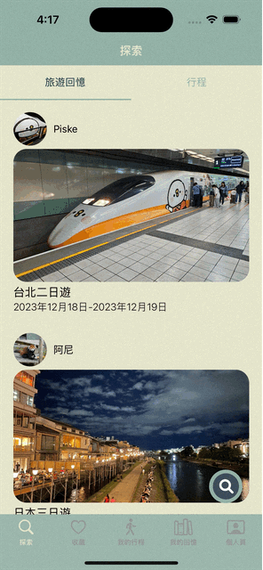

# TravelTogether
## Introduction   
TravelTogether is a platform designed for travel enthusiasts and aims to provide users with a convenient way to plan and share travel itineraries.

## Requirements
Minimun iOS version: 15

## Installation
Please go to App Store to download:
https://apps.apple.com/tw/app/traveltogether/id6474057254

or search "TravelTogether" in App Store.

## Features
- [Explore Users' Memories and Plans](#explore-users-memories-and-plans)
 - [Plan a Trip](#TripPlanning)
 - [Record and Share Travel Memories](#RecordandShareTravelMemories)

### Explore Users' Memories and Plans

- Explore the travel memories and plans of other users.
- Click the like button to save them to their favorites.
- Click the copy button to copy the user's travel plan.

### Plan a Trip

- Go to "我的行程" to plan the trip.
- Able to add a new day, new location in a trip.
- Able to drag and drop a specific location to change locations' order.

### Record and Share Travel Memories

- Create new travel memories based on existing travel plans and save as a draft.

- Create new travel memories based on existing travel plans and post on the platform.

## Technique Detail
- Implemented the MVC architecture for constructing maintainable code.
- Stored users’ travel itineraries and memories securely by using FirebaseFirestore.
- Stored and displayed photos of places by leveraging FireStorage, which enhanced the user experience in itinerary editing.
- Managed user accounts using FirebaseAuth and offered several login methods, including Native registration (email/password), Google, and Apple.
- Retrieve and display geographical information by integrating GoogleMap SDK.
- Ensured code consistency and quality using SwiftLint.

## License
This project is licensed under the [MIT License](LICENSE).